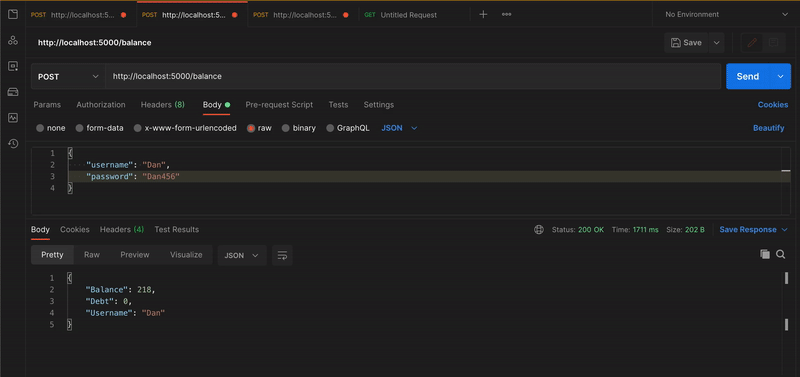

# flask_basic_bankAPI_MongDoc
Basic flask web api of a Bank scenario to deposit, take and pay loan, and transfer as one service and MongoDB db store as another service, with both services managed by docker.
  

  
#### To build and run all services
First we make sure Docker is running or will recieve an error  
`docker-compose build`  
To run the container  
`docker-compose up`      

## Notes:
### Note for flask:
On terminal when we hit `flask run`, it sets up a web server for us at local IP 127.0.0.1 and listens on port 5000. 
Status code 200 is ok and 404 is not found. We specify custom status codes to return to know the execution scenario we are in. 

Resource: What your offering eg: &nbsp; +, &nbsp; -, &nbsp; *, &nbsp; /  
Method: GET POST PUT DELETE  
Path: Where Resource is located  
used for: Description of what Method is going to do  
Param: The paramaters that the Path is expecting  
on error: the status codes based on user requests  

#### Resource Method Chart
| Resource | Method | Path | Used For | Param | On Error |
| ------------- | ------------- | ------------- | ------------- | ------------- | ------------- |
| + | POST | /add | adding 2 nums | x:int,y:int | 200 ok, 301 missing argument |
| - | POST | /subtract | subtracting 2 nums | x:int,y:int | 200 ok, 301 missing argument |
| / | POST | /divide | dividing 2 nums | x:int,y:int | 200 ok, 301 missing argument, 302 y is zero |
| * | POST | /multiply | multiply 2 nums | x:int,y:int | 200 ok, 301 missing argument |

Registration of a user to open account  
Check Balance to see balance and dept  
Transfer money to another user  
Take and Pay loans from BANK  
Transfer and Deposit fee goes to BANK  

#### Resource Method Chart

Resource  
Address  
Protocol  
Param  
Response and Status codes  

| Resource | Address | Protocol | Param | Response and Status codes |
| ------------- | ------------- | ------------- | ------------- | ------------- |
| Register User | /register | POST | username:str,pasword:str | 200 ok, 301 invalid username |
| Deposit | /deposit | POST | username:str,pasword:str,amount:str | 200 ok, 301 invalid username, 302 invalid password, 303 out of tokens, 304 invalid entry  |
| Transfer | /transfer | POST | username:str,password:str,reciever:str,amount:int | 200 ok, 301 invalid username, 302 invalid password, 303 insuffient balance, 304 invalid entry  |
| Check Balance | /balance | POST | username:str,password:str | 200 ok, 301 invalid username, 302 invalid password,304 invalid refillPassword |
| Take Load | /takeloan | POST | username:str,password:str,amount:int | 200 ok, 301 invalid username, 302 invalid password, 304 invalid refillPassword, 304 invalid entry  |
| Pay Load | /payloan | POST | username:str,password:str,amount:int | 200 ok, 301 invalid username, 302 invalid password, 303 insuffient balance, 304 invalid entry  |

### Note to Dockerise Flask and Mongo services:
Navigate to folder with flask python app.  
`sudo !!` to run previous command with sudo permissions if you need it  
Create a "web" folder for the server or flask app. `mkdir web`  
Create a "db" folder for the database. `mkdir db`  
Copy the server file into "web" folder. `cp ../app.py`  
In the 'web' folder run run `Docker touch` to make a docker file.  
Then run `touch requirements.txt` to make requirements.txt file.  
In the 'db' folder run run `Docker touch` to make a docker file.  

#### In the Dockerfile in web directory  
'  
FROM python:3   
WORKDIR /usr/src/app  
COPY requirements.txt .  
RUN pip3 install --no-cache-dir -r requirements.txt  
COPY . .  
RUN pip3 install ./en_core_web_sm-3.0.0.tar.gz  
CMD ["python3", "imgClassify.py"]  
'  

#### In the requirements.txt file  
'  
Flask  
flask_restful  
pymongo  
bcrypt  
spacy  
'  

#### In the Dockerfile in db directory  
'  
FROM mongo:`<VERSION-NO>`  
'    

#### In the directory containing seach of the services 'web', 'db' 
We make a docker-compose file to control each container  
`touch docker-compose.yml`  
And in that file we write  
'  
version: '3'  
services:  
&emsp; web:  
&emsp; &emsp; build: ./web  
&emsp; ports:  
&emsp; &emsp; - "5000:5000"  
&emsp; db:  
&emsp; &emsp; build: ./db  
'  

#### Upon finalization of changes to the docker files or app files we build and run all services
First we make sure Docker is running or will recieve an error  
`docker-compose build`  
To run the container  
`docker-compose up`  

### When trying to run locally on localhost:5000 and there is already an app runnin on that port:  
To find what's running on port 5000:  
`sudo lsof -i :5000`   
To kill it  
`kill -9 <pid>`  
 

### Note for Mongodb:
_id is a 12 bytes hexadecimal number which assumes the uniqueness of every document.  
You can provide _id while inserting the document.    
If you don't provide then Mongodb provides a unique id for every document.  
The 12 bytes of _id:  
- 4 bytes of current stamp  
- Next 3 of machine id  
- Next 2 of process id of mongodb server  
- Last 3 are incremental value    

To have launchd start mongodb/brew/mongodb-community now and restart at login:  
&emsp;`brew services start mongodb/brew/mongodb-community`  
  or  
&emsp;`brew services start mongodb-community@<Version-No>`    
If you don't want/need a background service you can just run:  
&emsp;`mongod --config /usr/local/etc/mongod.conf`    

`mongo` to run mongodb  
&emsp;`db.help()` in the `mongo` shell to see all possible commands    

Creating a DB:  
`use <NAME-OF-DB>`  
To check the current selected DB:  
`db`  
List of all DB:   
`show dbs`  
`use <DB-NAME>` to select that DB to use.  
If not present in list you need to have atleast one document in DB.  
`db.dropDatabase()` to drop existing selected database    

`db.createCollection(<NAME>, <OPTIONS>)` to create collection  
eg: `db.createCollection("mycol", { capped: true, size: 3, max: 3 })`  
`show collections` to show collections  
Inserting a document into a collection eg: `db.mycol.insert({"name" : "magicalCollection"})`  
For multiple document insertion into a collection `db.mycol.insert([{}, {}, {}, {}])`  
`db.<COLLECTION-NAME>.drop()` to delete collection    

`db.COLLECTION_NAME.find({}).preety()` to query documents  
eg: db.mycol.find({$and:[{"likes":{$gte:50}}, {"title":"MongoDB Overview"}]}).preety()  
eg: db.mycol.find({$and:[{"likes":{$gte:50}}, {"likes":{$let:100}}]}).preety()  

update() looks for the value and does an in place update.  
save() replaces the entire document.  
`db.<COLLECTION_NAME>.update(<SELECTION-CRITERIA>,<UPDATED-DATA>)`  
eg: `db.mycol.update({'title':'MongoDB Overview'},{$set:{'title':'New MongoDB}})`  
By default MongoDB will only update a single document, to update all documents,  
eg: `db.mycol.update({'title':'MongoDB Overview'},{$set:{'title':'New MongoDB}},{multi:true})`  
To remove a document in a collection: `db.mycol.remove({"title":"MongoDB Overview})`   

Projection is to select necessary data in a document in a collection. 1 to show and 0 to not.  
eg of documents in a collection:   
&emsp; {"_id":ObjectId(598783248985601dfd3),"title":"MongoDB Overview"}  
&emsp; {"_id":ObjectId(598783248985601dfd4),"title":"NOSQL Overview"}  
`db.mycol.find({},{"title":1,_id:0}).limit(1)` shows {"title":"MongoDB Overview"}    

MongoDB sort() medthod to return documents in a collection in accending 1 or decending -1 order.  
eg: `db.COLLECTION_NAME.find().sort({"likes":1})` to sort the key "likes" in accending order.  
